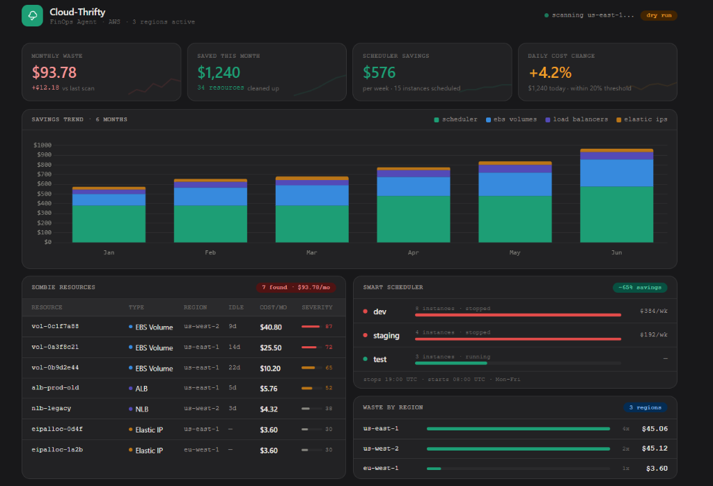

# Cloud-Thrifty 💸 — Automated FinOps Agent for AWS


> *"Cloud waste is a $30B+ annual problem. Cloud-Thrifty is an automated agent that identifies idle resources and enforces power-scheduling — reducing non-prod costs by ~60%."*

[](https://github.com/your-org/cloud-thrifty/actions/workflows/deploy.yml)




---

## What It Does

Cloud-Thrifty is a production-grade FinOps agent built on AWS Lambda + Terraform. It runs three automated modules:

| Module | Trigger | What it does |
|---|---|---|
| **Waste Hunter** | Every 6 hours | Scans for unattached EBS volumes, orphaned Elastic IPs, and idle load balancers |
| **Smart Scheduler** | 7 PM / 8 AM Mon–Fri | Stops Dev/Staging EC2 + RDS at night, starts them in the morning |
| **Real-Time Notifier** | On detection / Daily | Sends Slack/Discord alerts before deletion; triggers cost spike alerts |

### Results (example month)
| Item | Count | Savings |
|---|---|---|
| Orphaned EBS volumes deleted | 12 | $312/mo |
| Elastic IPs released | 5 | $18/mo |
| Dev instances power-scheduled | 8 | $576/mo |
| **Total** | | **~$906/mo** |

---

## Architecture

```
EventBridge (cron)
      │
      ├─► waste_hunter.py  ─── EC2 / ELB / CloudWatch APIs ──► S3 (reports)
      │                                  │
      ├─► smart_scheduler.py ── EC2 / RDS APIs               │
      │                                  │                    │
      └─► notifier.py ─────── Cost Explorer API              │
                │                                            │
                └── Slack / Discord Webhook ◄────────────────┘
                                                 Dashboard reads S3
```

All infrastructure is managed with **Terraform** — zero ClickOps.

---

## Quick Start

### Prerequisites
- AWS CLI configured (`aws configure`)
- Terraform ≥ 1.5
- Python 3.12+
- A Slack Incoming Webhook URL

### 1. Clone and configure
```bash
git clone https://github.com/your-org/cloud-thrifty.git
cd cloud-thrifty/terraform
cp terraform.tfvars.example terraform.tfvars
# Edit terraform.tfvars with your Slack webhook and account details
```

### 2. Deploy (dry-run mode — nothing is deleted)
```bash
terraform init
terraform plan
terraform apply
```

### 3. Test locally
```bash
cd ..
pip install boto3 moto pytest
pytest tests/ -v
```

### 4. Invoke manually
```bash
# Test the Waste Hunter in dry-run mode
aws lambda invoke \
  --function-name cloud-thrifty-waste-hunter \
  --payload '{}' \
  response.json && cat response.json

# Force a stop cycle
aws lambda invoke \
  --function-name cloud-thrifty-smart-scheduler \
  --payload '{"action": "stop"}' \
  response.json
```

### 5. Go live
Once you've reviewed a few Slack alerts and trust the findings, flip the flag:
```hcl
# terraform.tfvars
dry_run = false
```
Then `terraform apply` again.

---

## Configuration Reference

| Variable | Default | Description |
|---|---|---|
| `target_regions` | `us-east-1,us-west-2` | Regions to scan |
| `idle_ebs_days` | `7` | Days before an unattached volume is flagged |
| `idle_lb_days` | `3` | Days of zero traffic before a LB is flagged |
| `scheduler_environments` | `dev,staging,test` | Environment tag values to power-schedule |
| `anomaly_threshold_pct` | `20` | % daily spend increase that triggers an alert |
| `dry_run` | `true` | **Start here.** Set false only when ready |

---

## Opting Resources Out

Tag any resource with `keep:true` and Cloud-Thrifty will skip it permanently:

```bash
# Keep a volume (e.g. it holds important snapshots)
aws ec2 create-tags \
  --resources vol-0abc1234 \
  --tags Key=keep,Value=true

# Opt an instance out of power-scheduling
aws ec2 create-tags \
  --resources i-0abc1234 \
  --tags Key=scheduler:skip,Value=true
```

---

## Project Structure

```
cloud-thrifty/
├── src/
│   ├── waste_hunter.py       # Module 1: zombie resource detection
│   ├── smart_scheduler.py    # Module 2: tag-based auto stop/start
│   └── notifier.py           # Module 3: Slack alerts + cost anomaly
├── terraform/
│   ├── main.tf               # Lambda, IAM, EventBridge, S3
│   ├── variables.tf
│   ├── outputs.tf
│   └── terraform.tfvars.example
├── tests/
│   └── test_cloud_thrifty.py # moto-based unit tests (no real AWS needed)
├── dashboard/
│   └── index.html            # Live savings dashboard
└── .github/
    └── workflows/
        └── deploy.yml        # CI: test → plan (PR) → apply (main)
```

---

## Cost of Running Cloud-Thrifty

Cloud-Thrifty itself is nearly free to operate:

| Resource | Monthly cost |
|---|---|
| 3× Lambda functions (~120 invocations/month) | ~$0.00 (free tier) |
| S3 report storage (~10 MB) | ~$0.00 |
| CloudWatch Events rules | $0.00 |
| **Total** | **< $1/month** |

---

## Extending Cloud-Thrifty

- **Add RDS snapshot cleanup**: adapt `waste_hunter.py` to scan for snapshots older than N days
- **Add S3 bucket analysis**: flag buckets with zero requests for 30+ days
- **Multi-cloud**: the architecture ports cleanly to Azure Functions + Azure SDK
- **Grafana dashboard**: point Grafana at the S3 JSON reports using the S3 datasource plugin

---
---

## License

MIT — free to use, modify, and deploy.
