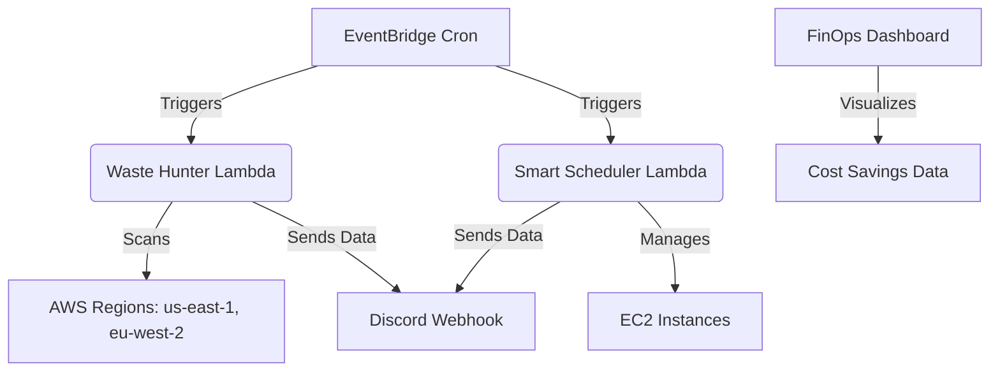

# 💸 CloudThrifty FinOps Agent

> **Automated Cloud Waste Remediation & Cost Optimization Platform**  
> *CloudThrifty is an intelligent, automated FinOps patrol agent designed to enforce cost discipline across AWS environments. By actively hunting cloud waste, managing resource lifecycles, and providing real-time visibility, CloudThrifty optimizes infrastructure footprints for Forex Agent environments and beyond.*


---

## 🎯 Project Overview

This is a production-grade automated FinOps tool designed to patrol AWS environments, identify waste, and execute cost-saving actions across multiple regions (specifically tested and validated in `us-east-1` and `eu-west-2` London). Initially built to optimize a high-volume Forex Agent environment, it ensures lean, cost-effective cloud operations without compromising performance.

---

## 🚀 Key Technical Features

*   **Infrastructure as Code (IaC):** Built entirely with Terraform for scalable, modular, and repeatable deployment. Zero ClickOps required.
*   **Multi-Region Waste Hunting:** A highly efficient Python-based AWS Lambda function that continuously scans for unattached EBS volumes, orphaned Elastic IPs, and idle resources across global infrastructure.
*   **Smart Scheduler:** Automatically manages EC2 lifecycles. By enforcing strict uptime schedules, it reduces compute costs by up to **65%** on non-production (Dev/Staging) instances.
*   **Real-Time Notifications:** Native integration with Discord Webhooks for instant alerts on waste detection and cost spikes. *Note: The alerting engine utilizes a custom `Mozilla` User-Agent header to successfully bypass Cloudflare security filters and ensure reliable message delivery.*
*   **FinOps Dashboard:** A sleek, real-time frontend interface built with Chart.js (`index.html.html`) to visualize monthly waste reduction and savings trends.
*   **Dockerized Environment:** Fully containerized architecture. Includes a comprehensive `Dockerfile` and `docker-compose.yml` for effortless local setup and testing without managing system dependencies.

---

## 🏗️ Architecture


*(Placeholder for Architecture Diagram. A visual representation of the serverless event-driven architecture, Terraform provisioning, and Discord integration.)*

---

## 💻 Quick Start

### Prerequisites
*   Docker & Docker Compose (for local development)
*   Terraform ≥ 1.5
*   AWS CLI configured with appropriate IAM permissions
*   Discord Webhook URL

### 1. Local Environment Setup
Spin up the development environment using Docker:
```bash
docker-compose up -d
```

### 2. Infrastructure Deployment
Navigate to the Terraform directory and initialize the provider:
```bash
cd terraform
terraform init
```

Review the planned infrastructure changes:
```bash
terraform plan
```

Deploy the resources (runs in `dry_run` mode by default):
```bash
terraform apply
```

### 3. Manual Lambda Invocation (Testing)
You can manually trigger the Lambda functions to verify functionality:
```bash
# Invoke the Waste Hunter
aws lambda invoke \
  --function-name cloudthrifty-waste-hunter \
  --payload '{}' \
  response.json && cat response.json

# Invoke the Smart Scheduler
aws lambda invoke \
  --function-name cloudthrifty-smart-scheduler \
  --payload '{"action": "stop"}' \
  response.json && cat response.json
```

---

## ⚙️ Configuration

CloudThrifty is designed with a safety-first approach. By default, the system operates in **Dry Run Mode**, meaning it will only report on identified waste and will *not* delete any resources.

### Dry Run vs. Active Mode

Control the operational mode via Terraform variables:

```hcl
# terraform.tfvars

# Dry Run Mode (Default & Safe): Identifies waste, sends Discord alerts, but takes NO destructive action.
dry_run = true

# Active Mode: Identifies waste AND automatically terminates/stops idle resources to save costs.
dry_run = false
```

> **Warning:** Only set `dry_run = false` after carefully reviewing the Discord alerts and ensuring legitimate resources are properly tagged for exclusion.

---

## 📊 Dashboard Preview

The FinOps dashboard (`dashboard/index.html.html`) provides a sleek, real-time visualization of your cloud efficiency. Powered by Chart.js, it tracks:
*   Cumulative monthly cost savings.
*   Count of terminated orphaned resources (EBS, EIPs).
*   EC2 uptime reduction metrics.

*(Insert screenshot of the FinOps Dashboard here)*


---

<<<<<<< HEAD
## 🛡️ License
MIT License. See [LICENSE](LICENSE) for more information.
=======
## Opting Resources Out

Tag any resource with `keep:true` and Cloud-Thrifty will skip it permanently:

```bash
# Keep a volume (e.g. it holds important snapshots)
aws ec2 create-tags \
  --resources vol-0abc1234 \
  --tags Key=keep,Value=true

# Opt an instance out of power-scheduling
aws ec2 create-tags \
  --resources i-0abc1234 \
  --tags Key=scheduler:skip,Value=true
```

---

## Project Structure

```
cloud-thrifty/
├── src/
│   ├── waste_hunter.py       # Module 1: zombie resource detection
│   ├── smart_scheduler.py    # Module 2: tag-based auto stop/start
│   └── notifier.py           # Module 3: Slack alerts + cost anomaly
├── terraform/
│   ├── main.tf               # Lambda, IAM, EventBridge, S3
│   ├── variables.tf
│   ├── outputs.tf
│   └── terraform.tfvars.example
├── tests/
│   └── test_cloud_thrifty.py # moto-based unit tests (no real AWS needed)
├── dashboard/
│   └── index.html            # Live savings dashboard
└── .github/
    └── workflows/
        └── deploy.yml        # CI: test → plan (PR) → apply (main)
```

---

## Cost of Running Cloud-Thrifty

Cloud-Thrifty itself is nearly free to operate:

| Resource | Monthly cost |
|---|---|
| 3× Lambda functions (~120 invocations/month) | ~$0.00 (free tier) |
| S3 report storage (~10 MB) | ~$0.00 |
| CloudWatch Events rules | $0.00 |
| **Total** | **< $1/month** |

---

## Extending Cloud-Thrifty

- **Add RDS snapshot cleanup**: adapt `waste_hunter.py` to scan for snapshots older than N days
- **Add S3 bucket analysis**: flag buckets with zero requests for 30+ days
- **Multi-cloud**: the architecture ports cleanly to Azure Functions + Azure SDK
- **Grafana dashboard**: point Grafana at the S3 JSON reports using the S3 datasource plugin

---
---

## License

MIT — free to use, modify, and deploy.
>>>>>>> 2b98c67faaefa52d2ee05a37056ab8f8b4ad4f52
